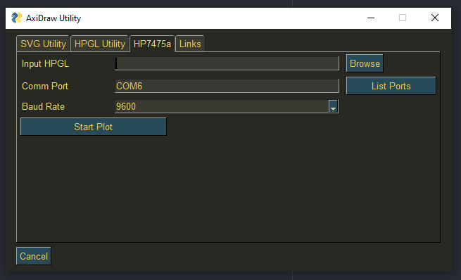

# HP7475a Pen Plotter Utility

Python GUI to simplify working with pen plotters:
- Now supporting: Graphtec MP4200, HP7475a
- Standalone version for Raspberry PI headless printing.
- Telegram notification on print ended
- Poweroff your plotter on print end using a Tasmota-enabled Sonoff controller
- Combine CMYK Split with Flow Imager

[](https://github.com/henrytriplette/plotter-utility)

## Installation

Create a virtual environment:

```bash
python3 -m venv venv
source venv/bin/activate
```

Plotter Utility uses:

- vpype [Installation instructions](https://github.com/abey79/vpype/#installation)
- vpype-flow-imager [Installation instructions](https://github.com/serycjon/vpype-flow-imager#getting-started)
- svgo [Installation instructions](https://github.com/svg/svgo#installation)
- cmyksplit [Installation instructions](https://github.com/abey79/plottertools/tree/main/cmyksplit#installation)

After installing the dependencies, use Python package manager [pip](https://pip.pypa.io/en/stable/) to install the requirements for the GUI.

```bash
pip install requirements.txt
```
Or, if using the standalone version, just run

```bash
pip install requirements_standalone.txt
```

## Usage

For the GUI interface run:
```python
python main.py
```

For the standalone headless version
```python
python main.py
```

To keep the print running when closing the SSH connection, I suggest using a terminal multiplexer like `screen`

## Contributing
Pull requests are welcome. For major changes, please open an issue first to discuss what you would like to change.

## Contains
Contains code from the following libraires:
- vogelchr/hp7475a-send [LINK](https://github.com/vogelchr/hp7475a-send)

## License
[MIT](https://choosealicense.com/licenses/mit/)
